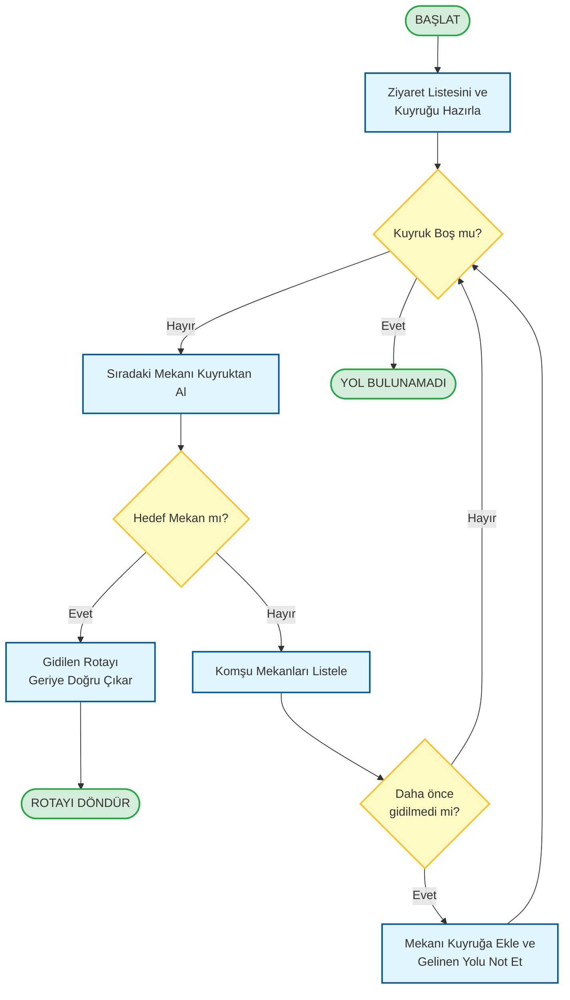

# İstanbul Sosyal Ağ Analizi

**Proje Adı:** İstanbul Turistik Mekanların Sosyal Ağ Analizi ve Görselleştirme Sistemi

**Ekip Üyeleri:** 
- Ceyda Özmen - 221307058
- Yusuf Can Müştekin - 231307082

**Proje Tarihi:20 Kasım 2025**

**Kocaeli Üniversitesi, Bilişim Sistemleri Mühendisliği**

---

## 1. Giriş

### 1.1 Problemin Tanımı

Günümüz modern şehirlerinde turistik mekanlar arasındaki ilişkiler; ziyaretçi hareketleri, mekansal yakınlıklar ve popülerlik etkileşimleri doğrultusunda karmaşık ve çok boyutlu bir ağ yapısı oluşturmaktadır. Özellikle İstanbul gibi tarihsel, kültürel ve turistik açıdan yüksek öneme sahip metropollerde bu ilişkilerin analizi; sürdürülebilir turizm planlaması, ziyaretçi deneyiminin iyileştirilmesi ve kentsel karar destek sistemlerinin geliştirilmesi açısından kritik bir rol oynamaktadır.

Bu proje kapsamında, İstanbul’da yer alan en popüler 50 turistik mekan bir graf (graph) yapısı olarak modellenmiştir. Mekanlar, düğümler (nodes) şeklinde temsil edilirken aralarındaki ilişkiler coğrafi yakınlık, ziyaretçi etkileşim yoğunluğu ve popülerlik düzeyi gibi kriterler doğrultusunda tanımlanan ağırlıklı kenarlar (weighted edges) ile ifade edilmiştir. Böylece karmaşık turistik ilişkiler matematiksel ve algoritmik olarak analiz edilebilir bir yapıya dönüştürülmüştür.

### 1.2 Projenin Amacı

Bu çalışmanın temel amacı, İstanbul’un sembolik ve yoğun ilgi gören turistik lokasyonlarını matematiksel ve algoritmik yöntemler kullanarak analiz etmek ve kentsel turizm ağının yapısal özelliklerini ortaya koymaktır. Bu doğrultuda proje aşağıdaki hedefleri kapsamaktadır:

1. **Graf Teorisi Uygulaması:** Gerçek dünya turizm verilerinin graf teorisi prensipleri kullanılarak dijital bir graf veri yapısına dönüştürülmesi.
   
3. **Algoritma Analizi:** BFS, DFS, Dijkstra, A*, Floyd–Warshall gibi klasik graf algoritmalarının uygulanması ve performanslarının analiz edilmesi.
   
5. **Sosyal Ağ Analizi:** Merkezilik ölçütleri kullanılarak ağ içerisindeki en etkili ve popüler turistik mekanların tespit edilmesi.
   
7. **Topluluk Tespiti:** Bağlı bileşenler analizi yoluyla turistik mekanların oluşturduğu grupların ve ayrık alt yapıların belirlenmesi.
   
9. **Graf Renklendirme:** Welsh–Powell algoritması kullanılarak grafın optimal biçimde renklendirilmesi ve çakışmaların önlenmesi.
    
11. **Görselleştirme:** Oluşturulan ağ yapısının kullanıcı dostu, interaktif ve anlaşılır basit bir biçimde görselleştirilmesi.

   
### 1.3 Projenin Kapsamı

Proje kapsamında:
- Küçük ve orta ölçekli senaryoları temsil etmek amacıyla 20 ve 50 turistik mekan ayrı ayrı düğümler olarak modellenmiştir.
  
- Mekanlar arasındaki ilişkiler, yönsüz ve ağırlıklı kenarlar şeklinde tanımlanmıştır.
  
- Kenar ağırlıkları; mekanların aktiflik düzeyi, sosyal etkileşim yoğunluğu ve bağlantı sayısı gibi parametreler dikkate alınarak aşağıda verilen formül ile hesaplanmıştır.
  
 $$Agirlik_{i,j} = \frac{1}{1 + \sqrt{(Aktiflik_i - Aktiflik_j)^2 + (Etkilesim_i - Etkilesim_j)^2 + (Baglanti_i - Baglanti_j)^2}}$$
 
- Temel graf algoritmalarının tamamı sistem içerisinde gerçeklenmiş ve farklı senaryolar üzerinde test edilmiştir.
  
- Yazılım mimarisi, nesne yönelimli programlama prensipleri doğrultusunda modüler bir yapı olacak şekilde tasarlanmıştır.

---

## 2. Kullanılan Teknolojiler

- **Programlama Dili:** Python
- **Görselleştirme:** Tkinter
- **Veri Formatı:** CSV, JSON

---

## 3. Algoritmalar

### 3.1 Breadth-First Search (BFS) - Genişlik Öncelikli Arama

BFS algoritması, bir başlangıç düğümünden itibaren grafı katman katman gezerek en yakın komşulardan başlayacak şekilde tüm erişilebilir düğümleri keşfeder.Çekirdek yapısında FIFO (First-In-First-Out) mantığına dayalı bir kuyruk (queue) veri yapısı kullanır. Algoritma, ağırlıksız graflarda en kısa yol bulma problemi için optimal bir çözüm sunar.

Turistik mekanlar arasındaki erişilebilirlik analizinde ve başlangıç noktasından itibaren ağın katmanlı yapısının keşfedilmesinde ve en az adımda ulaşılabilecek mekanların tespitinde kullanılmıştır.

#### Karmaşıklık Analizi

- **Zaman Karmaşıklığı:** O(V + E)
  - V: Düğüm sayısı
  - E: Kenar sayısı
  - Her düğüm ve kenar bir kez işlenir.

- **Alan Karmaşıklığı:** O(V)
  - Kuyruk en kötü durumda tüm düğümleri içerebilir.
  - Ziyaret durumu dizisi V eleman içerir.

---

### 3.2 Depth-First Search (DFS) - Derinlik Öncelikli Arama

DFS algoritması, bir başlangıç düğümünden itibaren mümkün olduğunca derine inerek grafı gezmeye çalışır. Bir yolun sonuna geldiğinde geri döner ve diğer yolları keşfeder. Algoritma bir yığın (stack) yapısı kullanır veya özyinelemeli (recursive) olarak gerçeklenir.

Turistik ağ içerisindeki döngüsel yolların tespiti ve ağın topolojik yapısının derinlemesine incelenmesi için kullanılmıştır.

  

#### Karmaşıklık Analizi

- **Zaman Karmaşıklığı:** O(V + E)
  - Her düğüm ve kenar bir kez ziyaret edilir.

- **Alan Karmaşıklığı:** O(V)
  - Özyinelemeli çağrı yığını.

---

### 3.3 Dijkstra Algoritması - En Kısa Yol

Dijkstra algoritması, ağırlıklı graflarda bir başlangıç düğümünden diğer tüm düğümlere olan en kısa yolları bulur. Algoritma, açgözlü (greedy) yaklaşım kullanarak her adımda en düşük maliyetli düğümü seçer. Negatif ağırlıklı kenarlar içermeyen graflarda optimal sonuç verir.

Mekanlar arasındaki aktiflik, sosyal etkileşim ve bağlantı yoğunluğuna göre belirlenen Euclidean tabanlı ağırlık fonksiyonu kullanılarak en düşük maliyetli rotaların belirlenmesini sağlar.

#### Karmaşıklık Analizi

- **Zaman Karmaşıklığı:** 
  -  O((V + E) log V)

- **Alan Karmaşıklığı:** O(V)
  - Mesafe dizisi ve öncelik kuyruğu

---

### 3.4 A* (A-Star) Algoritması - Heuristik En Kısa Yol

A* algoritması, Dijkstra algoritmasının geliştirilmiş versiyonudur. Dijkstra algoritmasına sezgisel (heuristic) bir maliyet fonksiyonu ekleyerek arama uzayını hedefe doğru daraltan bir optimizasyon algoritmasıdır. Hedef düğüme olan tahmini mesafeyi (heuristic) kullanarak arama sürecini hızlandırır. Algoritma, f(n) = g(n) + h(n) formülünü kullanır.

- g(n): Başlangıçtan n düğümüne gerçek maliyet
- h(n): n düğümünden hedefe tahmini maliyet (heuristik)
- f(n): Toplam tahmini maliyet

İstanbul haritası üzerinde coğrafi koordinatlar arası kuş uçuşu mesafeyi sezgisel veri olarak kullanarak, hedef odaklı ve yüksek performanslı rota planlaması yapar.

#### Karmaşıklık Analizi

- **Zaman Karmaşıklığı:** O(b^d)
  - b: Dallanma faktörü (branching factor)
  - d: Hedefin derinliği
  - En Kötü Durum: O(E)

- **Alan Karmaşıklığı:** O(b^d)
  - En Kötü Durum: O(V)

---

### 3.5 Floyd-Warshall Algoritması - Tüm Çiftler En Kısa Yol

Floyd-Warshall algoritması, tüm düğüm çiftleri arasındaki en kısa yolları bulur. Dinamik programlama yaklaşımı kullanarak her adımda ara düğümler üzerinden geçen yolları değerlendirir.  Negatif ağırlıklı kenarları destekler ancak negatif döngü içermemelidir. Ağların genel geçiş kapasitesini ölçmede ve küçük-orta ölçekli çizgelerde tüm çiftler arası analizler için kullanılmaktadır.

#### Karmaşıklık Analizi

- **Zaman Karmaşıklığı:** O(V³)
 
- **Alan Karmaşıklığı:** O(V²)
  - Mesafe matrisi V×V boyutundadır.

---

### 3.6 Degree Centrality - Derece Merkeziliği

Degree Centrality, bir düğümün ağdaki önemini komşu sayısına göre belirler. Basit ama etkili bir merkezilik ölçütüdür ve düğümün doğrudan etkileşim gücünü gösterir. ğdaki her bir düğümün doğrudan bağlantı sayısını hesaplayarak İstanbul turistik ağındaki "en popüler" ve "merkezi" lokasyonları tespit eder.

#### Karmaşıklık Analizi

- **Zaman Karmaşıklığı:** O(V + E)
  
- **Alan Karmaşıklığı:** O(V)

---
